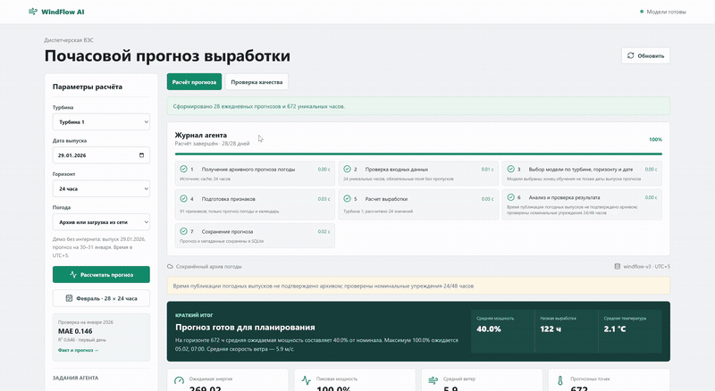
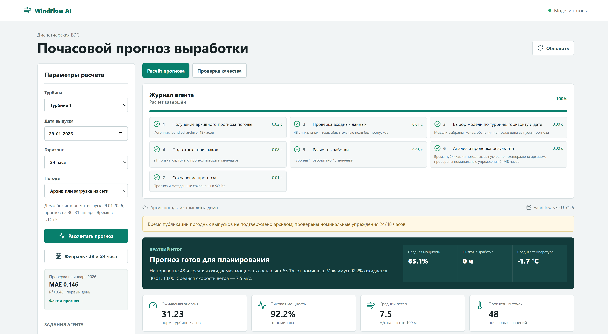
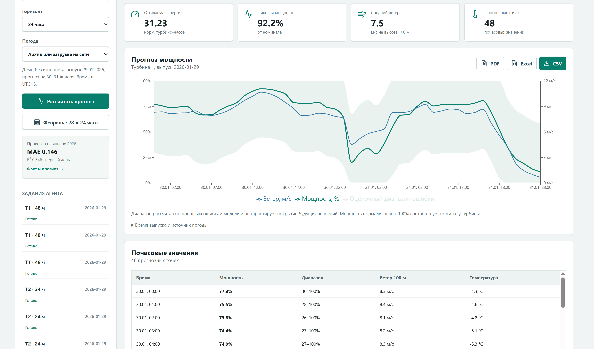
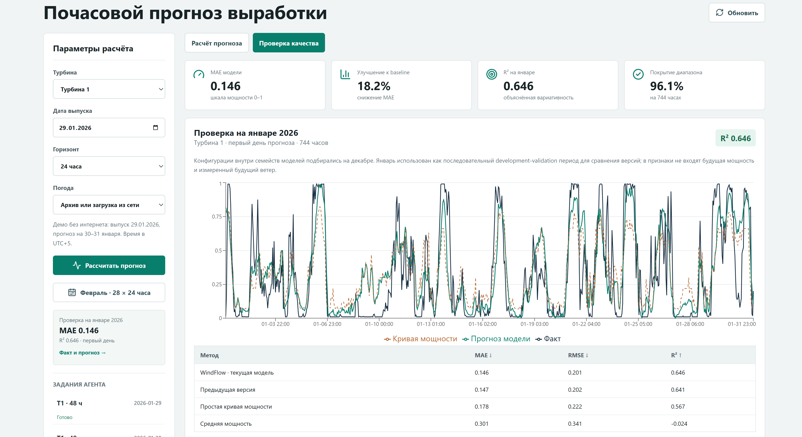

# WindFlow AI

WindFlow AI — система почасового прогнозирования нормализованной мощности
ветроэлектростанции на горизонте 24–48 часов. Она получает архивные прогнозы
погоды по координатам турбин, проверяет данные, выбирает ML-модель, формирует
прогноз и сохраняет результат вместе с журналом выполнения.

## Что решает продукт

Для планирования работы ВЭС важно заранее знать ожидаемую выработку. Ручной
расчёт трудно регулярно повторять, а использование фактической будущей погоды
даёт некорректную оценку модели. WindFlow AI автоматизирует полный цикл:

- получает архивный прогноз погоды с фиксированным упреждением 24/48 часов;
- проверяет полноту и корректность почасовых данных;
- выбирает модель для нужной турбины и части горизонта;
- прогнозирует мощность на следующие 24 или 48 часов;
- анализирует результат и сохраняет происхождение данных;
- повторяет расчёт при обновлении входных данных;
- формирует полный почасовой прогноз за февраль 2026 года.

Dashboard показывает графики мощности и погоды, диапазон ошибки, этапы агента,
метрики моделей, историю запусков и почасовую таблицу. PDF предназначен для
руководителя, Excel и CSV — для аналитической и статистической работы.

## Быстрый запуск

Готовые модели `windflow-v3` находятся в `backend/models/`, архив прогнозов
погоды — в `backend/demo/`. Они скачиваются вместе с репозиторием. Для расчёта
достаточно CPU: повторное обучение, видеокарта и API-ключи не нужны.

### Windows

Требования:

- Python 3.11 или новее;
- [uv](https://docs.astral.sh/uv/);
- Node.js 22.12 или новее.

Из корня репозитория:

```powershell
.\run.ps1
```

После сборки приложение будет доступно по адресу
[http://127.0.0.1:8000](http://127.0.0.1:8000), документация API — по адресу
[http://127.0.0.1:8000/docs](http://127.0.0.1:8000/docs).

Повторный запуск без переустановки зависимостей:

```powershell
.\run.ps1 -SkipInstall
```

Проверка backend-тестов и production-сборки frontend:

```powershell
.\run.ps1 -SkipInstall -Check
```

### Docker — альтернативный запуск

Если установлен Docker, Python и Node.js на компьютере отдельно не нужны.
Один контейнер запускает backend и собранный сайт с готовыми моделями:

```sh
docker compose up --build
```

Приложение откроется на [http://localhost:8000](http://localhost:8000).
SQLite и кэш погоды сохраняются в именованном Docker-томе.

### Режим разработки

Backend:

```sh
cd backend
uv sync --locked
uv run uvicorn app.main:app --reload
```

Frontend в отдельном терминале:

```sh
cd frontend
npm ci
npm run dev
```

Frontend будет доступен на [http://localhost:5173](http://localhost:5173),
backend — на [http://localhost:8000](http://localhost:8000).

## Как проверить решение

После установки зависимостей и запуска приложения этот сценарий работает
без интернета: обученные модели и архивы погоды января и февраля включены
в репозиторий.

<p align="center">
  <br>
  <a href="images/windflow-demo.mp4"><strong>Скачать видео в полном качестве · 25 секунд</strong></a><br>
  <sub>Расчёт прогноза → полный февраль → PDF-отчёт</sub>
</p>

### 1. Расчёт прогноза и журнал агента

Задайте параметры и нажмите **«Рассчитать прогноз»**:

| Параметр | Значение для проверки |
| --- | --- |
| Турбина | 1 или 2 |
| Дата выпуска | `2026-01-29` |
| Горизонт | 48 часов |
| Погода | Только сохранённый архив |

В журнале должны завершиться семь этапов — от получения погоды до сохранения
прогноза. Для каждого этапа видны статус, длительность и результат.

<p align="center">
  <a href="images/image1.png">
    
  </a><br>
  <sub>Журнал агента и краткий итог сохранённого прогноза. Нажмите на снимок, чтобы открыть его крупнее.</sub>
</p>

### 2. График, почасовые данные и отчёты

Проверьте график мощности и ветра, диапазон ошибки и **48 почасовых значений
за 30–31 января**. Скачайте PDF, Excel или CSV кнопками над графиком.
В боковой панели выберите завершённый запуск, чтобы открыть его из истории.

<p align="center">
  <a href="images/image.png">
    
  </a><br>
  <sub>Сохранённый прогноз на 48 часов, почасовые значения и экспорт отчётов.</sub>
</p>

### 3. Проверка качества модели

Откройте вкладку **«Проверка качества»** и сравните прогноз с фактом и простой
кривой мощности. Для каждой турбины доступны MAE, RMSE и R². Горизонт 24 часа
показывает оценку первого дня, 48 часов — второго дня прогноза.

<p align="center">
  <a href="images/image2.png">
    
  </a><br>
  <sub>Турбина 1 · первый день прогноза · проверка на январе 2026 года.</sub>
</p>

### 4. Полный февраль

Нажмите **«Февраль · 28 × 24 часа»**. После завершения ожидаются
**28 ежедневных выпусков и 672 уникальных часа** за 1–28 февраля 2026 года.
Скачайте месячный отчёт и повторите расчёт для второй турбины.
Этот сценарий и открытие PDF показаны в [видеодемонстрации](images/windflow-demo.mp4).

### Автоматическая проверка

```sh
cd backend
uv run ruff check app scripts tests
uv run pytest -q

cd ../frontend
npm run build
```

Тесты проверяют API, модельные артефакты, валидацию данных, журнал этапов,
обработку ошибок, идемпотентность и полноту CSV.

## Технологии

| Компонент | Технологии |
| --- | --- |
| Frontend | React, Vite, Recharts, Lucide |
| Backend | Python, FastAPI, Pydantic |
| ML | scikit-learn, XGBoost/CUDA для обучения, NumPy inference, pandas, joblib |
| Данные погоды | Open-Meteo Previous Runs API |
| Хранение | SQLite, локальный файловый кэш |
| Отчёты | ReportLab, OpenPyXL |
| Зависимости | uv, npm |
| Развёртывание | PowerShell, Docker Compose |
| Проверки | pytest, Ruff, Vite build |

## Архитектура

```text
React dashboard
      │
      ▼
FastAPI ──► очередь фоновых заданий ──► Agentic pipeline
                                                │
                    ┌───────────────────────────┼──────────────────────┐
                    ▼                           ▼                      ▼
             Open-Meteo / cache         Проверка данных        Выбор модели
                    │                           │                      │
                    └───────────────────────────┼──────────────────────┘
                                                ▼
                                      Признаки и ML-прогноз
                                                │
                                                ▼
                                  Контроль результата и SQLite
                                                │
                                                ▼
                              Графики, история и PDF / Excel / CSV
```

Агент последовательно выполняет семь наблюдаемых этапов:

1. получение архивного прогноза погоды;
2. проверка временной сетки и значений;
3. выбор модели по турбине, горизонту и дате;
4. подготовка признаков;
5. расчёт мощности;
6. анализ качества результата;
7. сохранение прогноза и метаданных.

Для каждого этапа сохраняются статус, время начала и завершения, длительность,
описание и технические метаданные. При временной ошибке погодного сервиса
запрос повторяется, после чего система может использовать сохранённый архив.

## Модели и качество

Мощность представлена в нормализованной шкале от 0 до 1. Признаки включают
архивный прогноз скорости ветра и температуры, изменения погоды внутри
горизонта и календарные характеристики. Будущие фактические показания турбин
при построении прогноза не используются.

Для каждой турбины используются отдельные модели первого и второго дня.
Сравниваются HistGradientBoosting, ExtraTrees и ансамбли; конфигурация
выбирается на временном validation-периоде.

Результаты хронологической проверки на январе 2026 года:

| Турбина и горизонт | Часов | MAE | RMSE | R² | Снижение MAE к wind curve |
| --- | ---: | ---: | ---: | ---: | ---: |
| 1, часы 1–24 | 744 | 0.146 | 0.201 | 0.646 | 18.16% |
| 1, часы 25–48 | 720 | 0.189 | 0.241 | 0.484 | 6.18% |
| 2, часы 1–24 | 744 | 0.151 | 0.204 | 0.634 | 15.73% |
| 2, часы 25–48 | 720 | 0.188 | 0.243 | 0.478 | 6.62% |

MAE и RMSE указаны в нормализованной шкале мощности. R² характеризует качество
описания изменений мощности и не является процентом точности. Исходные точки
для независимого пересчёта метрик находятся в
`backend/models/validation_predictions.csv`.

## Расчёт февраля 2026

Февральский режим воспроизводит 28 ежедневных выпусков и формирует по 672
уникальных почасовых значения для каждой турбины. В репозиторий включён
проверенный архив Open-Meteo для обеих точек, поэтому полный расчёт доступен
offline. Перед экспортом система проверяет временную сетку, происхождение
данных, SHA-256 и отсутствие дубликатов.

Подготовка архива погоды:

```sh
cd backend
uv run python -m scripts.prepare_demo
```

Расчёт и экспорт файлов:

```sh
uv run python -m scripts.export_submission --offline
```

Результаты сохраняются в `artifacts/submission/`: два CSV-файла, манифест и
отчёт с метриками. Команда подготовки нужна только для обновления погодного
архива; включённый архив уже позволяет воспроизвести расчёт без интернета.

Для каждого сохранённого прогноза доступны три формата:

- PDF — оформленный отчёт с резюме, KPI, графиком и почасовой таблицей;
- Excel — листы Summary, Hourly forecast, Agent log, Model metrics и Metadata;
- CSV — компактные почасовые данные для статистической обработки.

## Ежедневный запуск

Один выпуск прогноза для обеих турбин:

```sh
cd backend
uv run python -m scripts.run_daily --issue-date 2026-01-29 --offline
```

Постоянный режим планировщика:

```sh
uv run python -m scripts.run_daily --loop
```

В Docker планировщик запускается отдельным профилем:

```sh
docker compose --profile schedule up --build
```

## API

| Метод | Путь | Назначение |
| --- | --- | --- |
| `GET` | `/api/health` | Состояние сервиса и моделей |
| `GET` | `/api/models/metrics` | Метрики моделей |
| `GET` | `/api/models/validation` | Факт, прогноз и baseline |
| `POST` | `/api/jobs` | Фоновый прогноз на 24/48 часов |
| `POST` | `/api/jobs/february` | Расчёт февраля |
| `GET` | `/api/jobs` | История фоновых заданий |
| `GET` | `/api/jobs/{job_id}` | Прогресс, этапы и результат |
| `GET` | `/api/forecasts` | История сохранённых прогнозов |
| `GET` | `/api/forecasts/{run_id}` | Полный сохранённый прогноз |
| `GET` | `/api/forecasts/{run_id}/report.pdf` | PDF-отчёт одного прогноза |
| `GET` | `/api/forecasts/{run_id}/export.xlsx` | Excel одного прогноза |
| `GET` | `/api/forecasts/{run_id}/export.csv` | CSV одного прогноза |
| `GET` | `/api/forecasts/february/report.pdf` | PDF полного месяца |
| `GET` | `/api/forecasts/february/export.xlsx` | Excel полного месяца |
| `GET` | `/api/forecasts/february/export.csv` | CSV полного месяца |

Пример запуска:

```json
{
  "turbine_id": 1,
  "issue_date": "2026-01-29",
  "horizon_hours": 48,
  "data_mode": "offline"
}
```

Режимы получения погоды:

- `auto` — использовать локальный архив, при отсутствии обратиться к API;
- `offline` — использовать только сохранённые данные;
- `live` — загрузить данные из Open-Meteo.

## Переобучение

Исходные CSV передаются скрипту явно и не хранятся в репозитории:

```powershell
cd backend
uv run python -m scripts.train_models `
  --turbine-1 "C:\data\turbine 1.csv" `
  --turbine-2 "C:\data\turbine 2.csv"
```

Загруженная история погоды сохраняется в `backend/data_cache/`. Для повторного
обучения с готовым отчётом выбора моделей добавьте
`--selection-report models/model_selection.json`.

## Структура репозитория

```text
backend/
  app/                 FastAPI, агент и сервисы
  demo/                архив погоды для offline-запуска
  models/              обученные модели и отчёты
  scripts/             обучение, ежедневный запуск и экспорт
  tests/               автоматические тесты
frontend/
  src/                 React-dashboard
docs/                   технические материалы и проверка решения
Dockerfile              контейнер приложения
compose.yaml            приложение и планировщик
run.ps1                 запуск и проверка на Windows
```

## Конфигурация и безопасность

Приложение не требует API-ключей для Open-Meteo. Настройки можно передать через
`MODEL_DIR`, `DATABASE_PATH`, `DEMO_DIR`, `WEATHER_CACHE_DIR`,
`WEATHER_TIMEOUT_SECONDS` и `WEATHER_ATTEMPTS`.

Файлы `.env`, локальная SQLite, кэши, исходные датасеты и результаты запусков
исключены из Git. Для локальной настройки задайте нужные переменные окружения
в оболочке; API-ключи для запуска не требуются.

## Дополнительная документация

- [Протокол данных и оценки](docs/FORECAST_PROTOCOL.md)
- [Описание готовности решения](docs/DELIVERY.md)
